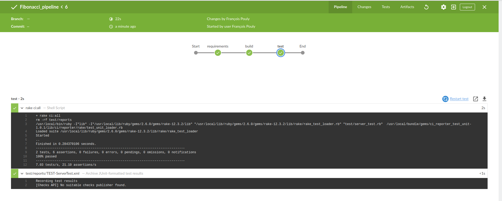

# Logbook

I have one week to complete the project, at the moment I am writing those lines, we are the 11th of December and have until the 18th to send it.

## Friday

The first thing I need to do is to create my GitHub repository. After that (and updated my Rubymine license), I began looking around the web to find more informations about Ruby APIs.
I found a first interesting article : [https://www.synbioz.com/blog/tech/api-ruby-rails-gem-grape]().
I also found on GitHub may interesting and already done APIs to calculate the Fibonacci sequence, however I preferred not to look at them in the first time, but it was kind of cool to know that it exists if needed in the future and to compare, once my API will be done, if my performances are OK or not.

I wanted, from the beginning, to implement tests, and maybe a CI pipeline in GitHub, so I also looked information about this.

I chose from the beginning to do it in Ruby, mainly because I did a few projects using Ruby, I think it is a great language and mostly because it is used by Perfect Memory.

This night, I also decided which git workflow I will be using ([Git Feature branch Workflow](https://www.atlassian.com/git/tutorials/comparing-workflows/feature-branch-workflow)).

Most of the researches I made to find out how to make an API using Ruby, I ended up on articles about Rails, and sometimes about Sinatra. I have already made 2 projects using Rails, and I know that a lot of its features will not be useful, and as it is a whole framework, it can be heavy for this project. Sinatra is much more lightweight than Rails, and easier, so I decided to use it.
[Sinatra's GitHub repository](https://github.com/sinatra/sinatra)

Finally this day I also created a new project on GitHub to decompose the project and have a good vision of the things to do.

## Saturday

I updated the API to return the number at the end of the Fibonacci sequence when the user asks the route '/api/v1/fibonacci/:number'.

It is a very basic version, and it will be upgraded after.

Afterthat, I will try to create a CI pipeline for my application [https://joachim8675309.medium.com/jenkins-ci-pipeline-with-ruby-62017469c7c9](https://joachim8675309.medium.com/jenkins-ci-pipeline-with-ruby-62017469c7c9)

It took quite a while, as I also had to deploy a Jenkins server on my machine, but at the end, my pipeline was working fine.

I also wanted to add a trigger to automatically run the tests each time I would push or merge something into the branches main or dev, unfortunately, this could be done with github's webhooks, but to use it my Jenkins should be online, which is not the case at the moment.

I spent some time to reorganize the project so to be more clear. I am using a controller to get the routes, and a model to calculate Fibonacci number.

I also want to find a way to store Fibonacci numbers to retrieve them in an effective way, I will use an hash table first.

If n is superior to about 100, an Integer (BigNum) isn't enough to store the result, so it is parsed into an float. It can also be too big to be stored in a float, and therefore I have to limit the n at the beginning to 1000.

# Sunday

Because of the Ruby uses the Integers, I had to find another to store very large numbers, as fibonacci(1000) has for instance 209 digits. So I created the class HugeInteger to store huge integers.

It is working like this : 
* there is a table of integers to store the values
* if the value can fit in an Integer, it needs only one index
* if the value is too big for an Integer, new indexes are created. The first index is the "least significant number".

I only had to overload the addition operator for this class as I am using only additions.
I also overloaded the "to_s" method to write it correctly.

Apparently, Ruby can deal with large numbers, as it is working perfectly well with the Inverted Fibonacci I wrote, so I will why it didn't work when I wanted to find the Fibonacci of a large number.

Also, I found a very fast to calculate Fibonacci numbers [here](http://www.maths.surrey.ac.uk/hosted-sites/R.Knott/Fibonacci/fibFormula.html#section1.1)
A method was proposed by Dijkstra back in 1978, and to compute Fibonacci(1000) it only uses 22 intermediate values.

This new method works very well, now I can compute Fibonacci numbers up to 15 millions, while it was hard to go up to 100000 with the last one. However a lot of code I did is now useless.

Finally, I added the tests for the inverted Fibonacci method. Added the tests was useful as I didn't that if I had 0 as input, a division by 0 was made.

# Monday

I added tests for my models, even though my test coverage might be high, I still need to work on those, I think they don't cover everything.

I also wanted to create the user friendly web interface for the API.

